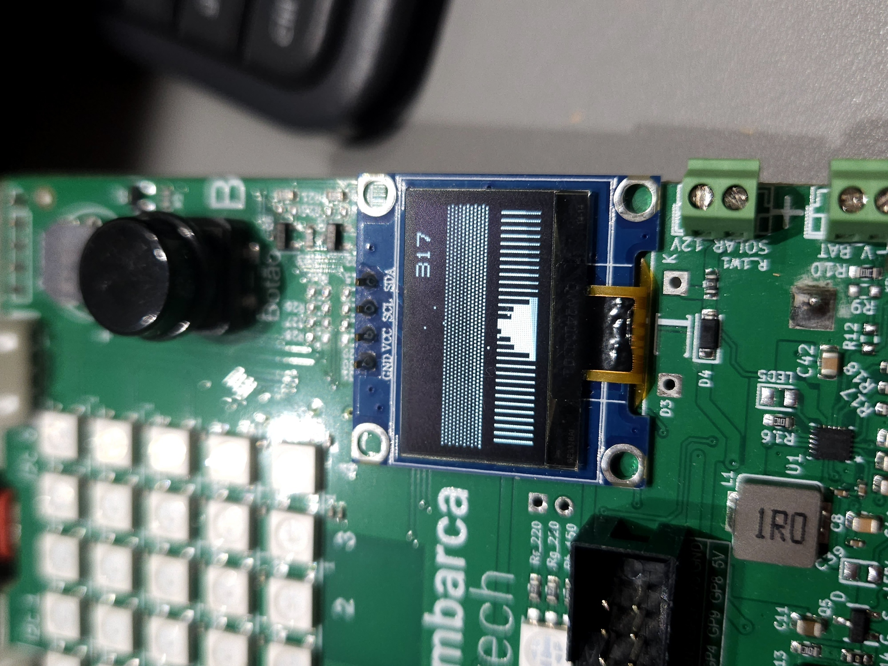
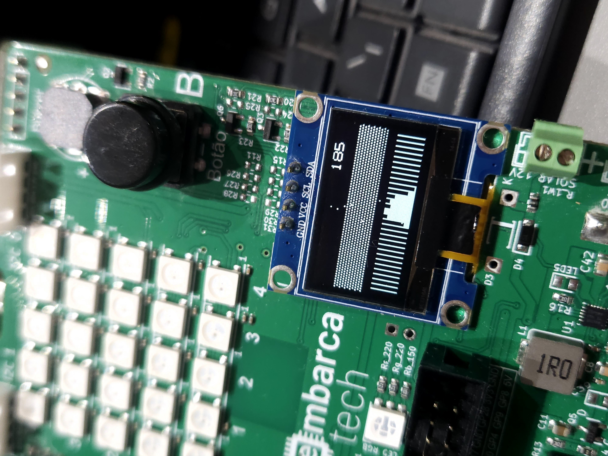

# Projeto de Sistemas Embarcados - EmbarcaTech 2025
### Simulação de Galton Board com SSD1306 no RP2040 (BitDogLab)

Autor: Luana Varela Vacari

Curso: Residência Tecnológica em Sistemas Embarcados

Instituição: EmbarcaTech - HBr

Campinas, ___ de 2025
## Introdução
Este documento apresenta a implementação de uma simulação digital do experimento conhecido como Galton Board, utilizando a BitDogLab com o microcontrolador RP2040 e uma tela OLED SSD1306 via comunicação I2C. O objetivo do projeto é representar o comportamento estatístico de distribuição binomial de forma visual e interativa.

*https://vanhunteradams.com/Pico/Galton/Galton_Stats.html*

## Visão Geral do Funcionamento
O sistema consiste em:

↪ Uma matriz de pinos onde as bolas colidem.

↪ Canaletas na parte inferior onde as bolas acumulam.

↪ Um histograma dinâmico exibido em tempo real na tela OLED.

↪ Um contador de bolas caídas exibido no canto superior direito.

As bolas são geradas em intervalos regulares e percorrem a estrutura sob efeito de uma "aleatoriedade" simulada. Ao final do percurso, a frequência de bolas em cada canaleta é atualizada e representada graficamente.

## Estrutura do Código
### Inicialização e Configuração
As bibliotecas do RP2040, tela SSD1306 e I2C são importadas. A função *oled_setup()* configura a comunicação I2C nos pinos GPIO 14 e 15. A tela é inicializada e limpa com *oled_clear()*.

### Representação das Bolas
As bolas são estruturadas com:

    typedef struct {
        int x;
        int y;
        bool ativa;
    } Bola;
Um vetor *Bola bolas[MAX_BOLAS]* armazena as bolas em uso, controlando posição e estado de atividade.
####  Considerações sobre a Entrada das Bolas
Importante destacar que as bolas não foram inseridas sempre na mesma linha vertical, mas sim dentro de uma faixa horizontal central do topo da tela. Essa abordagem simula melhor o funcionamento de Galton Boards físicos, nos quais a “boca” de entrada permite certa variação na posição inicial, refletindo condições mais realistas e contribuindo para a dispersão natural da distribuição.

### Pinos e Obstáculos
A função *esta_em_pino()* verifica se a posição atual de uma bola coincide com a localização de um pino na matriz. A lógica simula o efeito dos obstáculos ao fazer a bola se mover horizontalmente para esquerda ou direita de forma aleatória.

### Geração e Movimento de Bolas
A cada TICKS_NOVA_BOLA, uma nova bola é gerada centralmente e começa a cair. O movimento vertical é contínuo, e desvia horizontalmente caso encontre um pino.

    if (esta_em_pino(bolas[i].x, bolas[i].y)) {
        mover_horizontal_aleatorio(&bolas[i]);
    }
Quando a bola atinge a parte inferior da tela, sua posição horizontal é usada para identificar a canaleta correspondente com *identificar_canaleta()*. A frequência da canaleta é incrementada, a bola é desativada e o contador global é atualizado.

### Desenho da Cena
A função *desenha_cena()* é responsável por renderizar a tela a cada tick:

↪ Pinos são desenhados em padrão alternado.

↪ Canaletas são separadas por linhas verticais.

↪ Bolas ativas são desenhadas em sua posição atual.

↪ O histograma é renderizado de acordo com as frequências.

↪ Um contador mostra o total de bolas processadas.

## Lógica do Histograma
A função *desenhar_histograma()* normaliza a altura das barras de cada canaleta com base na maior frequência registrada. Isso permite exibir proporcionalmente a distribuição em tempo real:

    int altura_barra = (frequencias[i] * ALTURA_HISTOGRAMA) / max_freq;
Cada barra é desenhada com linhas verticais dentro da largura da canaleta.

## Controle de Tempo
A lógica de tick temporizado é feita com:

    if (absolute_time_diff_us(ultimo_tick, get_absolute_time()) >= INTERVALO_TICK_US)
Permitindo atualizar o sistema a cada 100 milissegundos, mantendo fluidez e controle determinístico da simulação.

## Dificuldades Encontradas
Durante o desenvolvimento, os principais desafios enfrentados foram:

↪ Cálculo da posição dos pinos: 

    Exigiu atenção à alternância horizontal das linhas de pinos para simular corretamente o padrão triangular.

↪ Escalonamento do histograma: 

    A normalização das frequências em altura proporcional ao máximo demandou ajustes finos para evitar distorções visuais.

↪ Eficiência na manipulação de bolas: 

    O controle simultâneo de várias instâncias ativas exigiu lógica robusta para ativar, mover, detectar colisão e desativar corretamente as bolas.

## Testes e Validação
A simulação foi submetida a testes com o objetivo de verificar o comportamento do sistema em diferentes condições de operação, garantindo a coerência da lógica implementada.

### Teste com Distribuição Aleatória Balanceada
No primeiro cenário, o programa foi executado com a função de desvio aleatório *(mover_horizontal_aleatorio())* operando normalmente, com igual probabilidade de desvio para a esquerda ou para a direita. A expectativa teórica é de que, após um número suficiente de bolas, a distribuição se aproxime de uma curva binomial, com maior concentração nas canaletas centrais. Este teste foi bem-sucedido: o histograma exibiu a forma esperada de sino (distribuição normal aproximada).

### Teste com Favorecimento de Um Lado
Para simular viés na tomada de decisão da bolinha, a função *mover_horizontal_aleatorio()* foi alterada propositalmente para favorecer consistentemente um dos lados, neste caso, a direita. Essa modificação teve como objetivo avaliar a sensibilidade da simulação a pequenas mudanças na aleatoriedade. O resultado foi um desvio claro na distribuição de bolas para as canaletas do lado direito, o que valida a influência esperada do fator de assimetria no processo.

### Conclusão dos Testes
Ambos os testes reforçaram a consistência da lógica de simulação e a capacidade do sistema de refletir alterações no comportamento das partículas. Isso demonstra que o modelo pode ser útil não apenas como visualização estática de fenômenos aleatórios, mas também como ferramenta experimental para estudar variações de parâmetros estatísticos.

## Conclusão
O projeto cumpriu seu objetivo de representar visualmente uma simulação estatística de forma precisa e educativa. A modularização do código facilitou a manutenção e a clareza da lógica. A representação gráfica proporcionou uma forma intuitiva de visualizar a distribuição das bolas, com potencial para uso didático em aulas de estatística ou física.

## Vídeo de Demonstração
https://youtu.be/__VkWbK26pE?si=CsQPs99E9qBS5SVT

