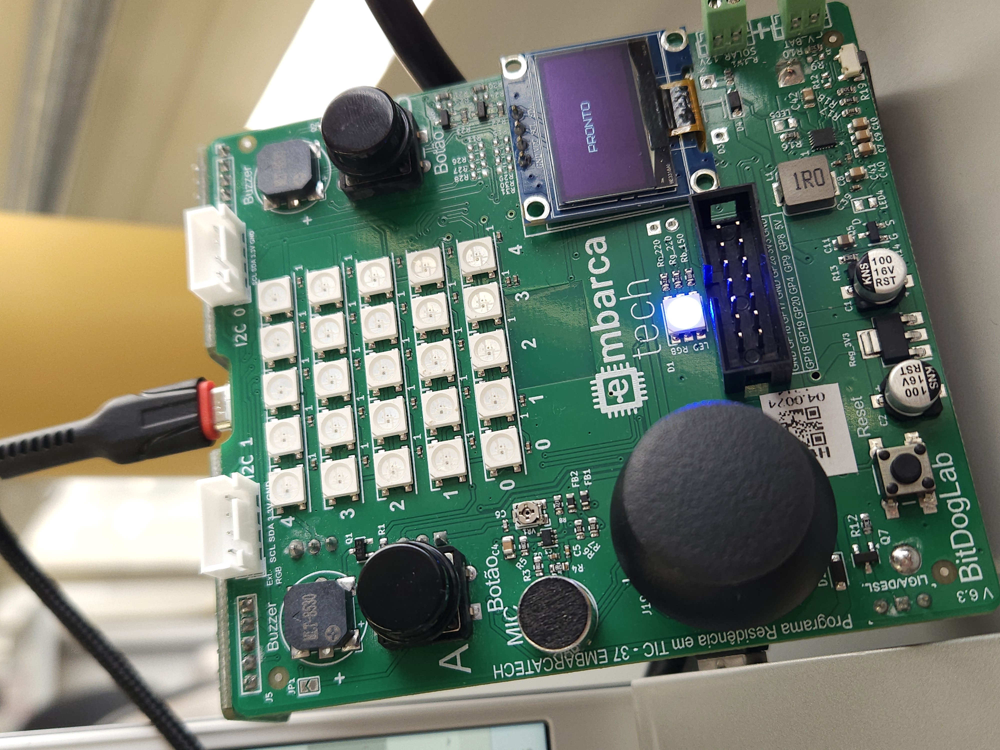
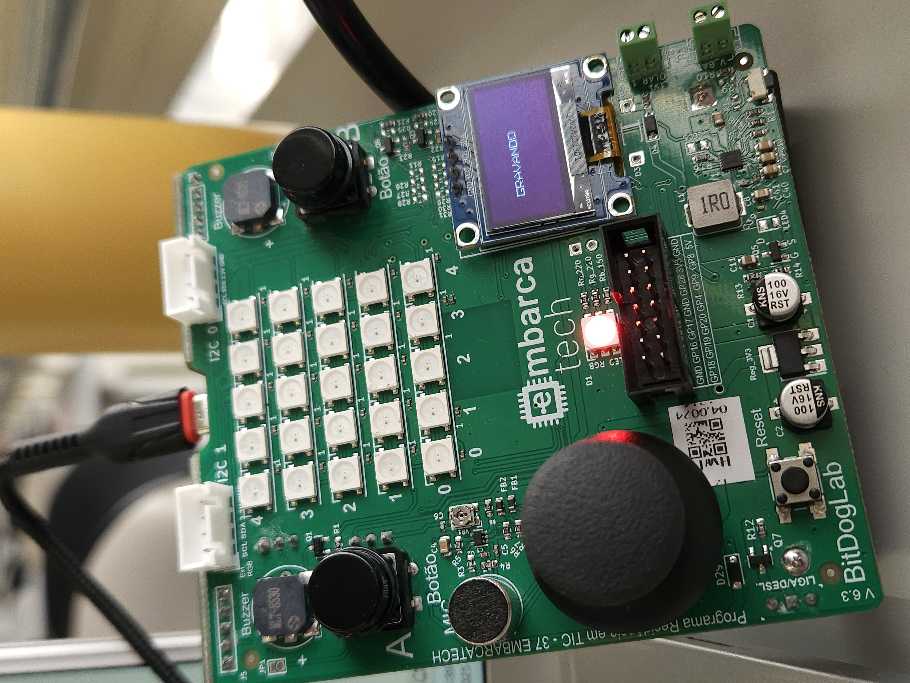
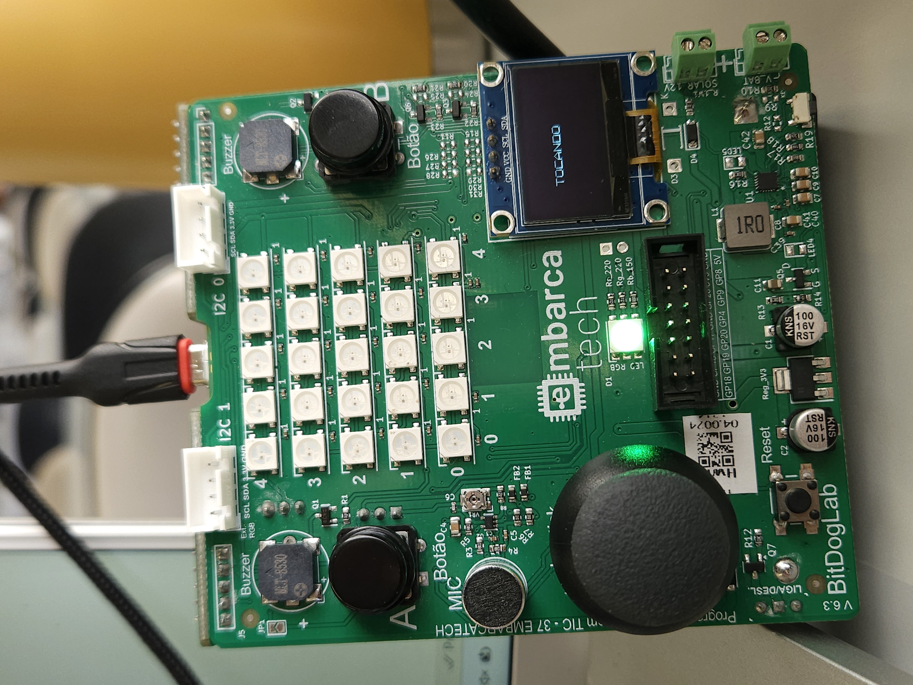
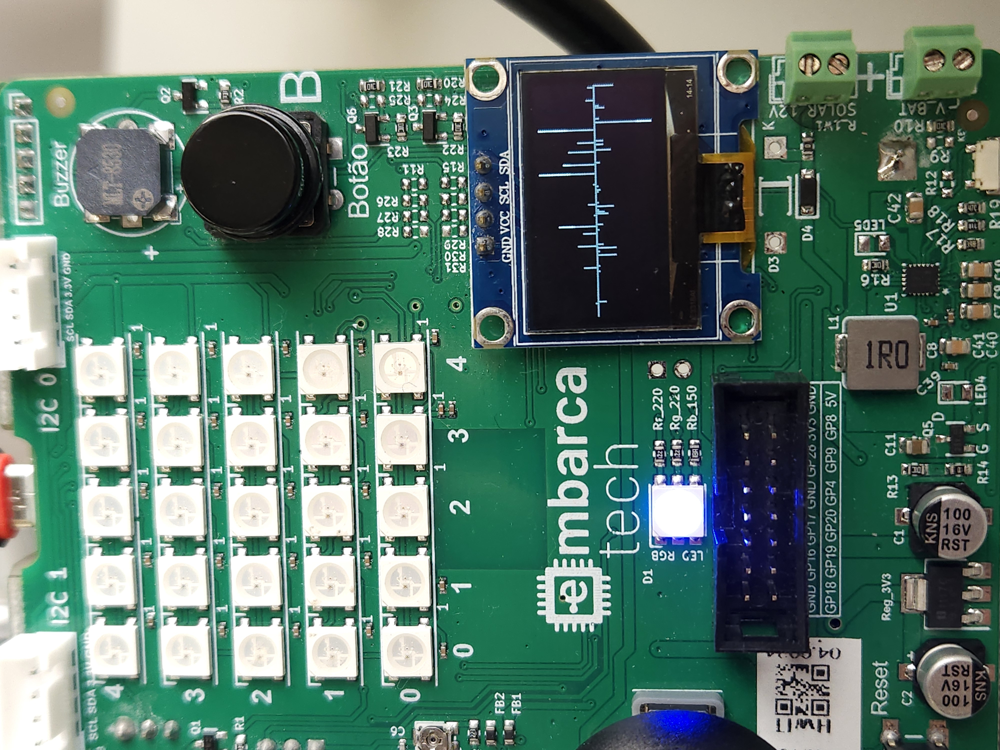

# Projetos de Sistemas Embarcados - EmbarcaTech 2025

Autor: **Luana Varela Vacari**

Curso: Residência Tecnológica em Sistemas Embarcados

Instituição: EmbarcaTech - HBr

Campinas, 09 de junho de 2025

## Visão Geral do Projeto

Este projeto consiste no desenvolvimento de um sintetizador de áudio utilizando a placa BitDogLab (baseada no RP2040). O sistema é capaz de gravar um áudio de duração pré-definida através do microfone embutido, armazenar essas amostras e, em seguida, reproduzi-las utilizando um buzzer ou alto-falante externo via modulação PWM. O controle das funções de gravação e reprodução é realizado por meio de botões, com feedback visual fornecido por LEDs e uma visualização da forma de onda do áudio gravado em um display OLED.

Este projeto foi desenvolvido como parte das atividades de aprendizado, com foco em compreender e implementar conceitos de captura, armazenamento, processamento e reprodução de áudio digital em sistemas embarcados.

## Funcionalidades Implementadas

* **Gravação de Áudio:** Captura de áudio analógico do microfone e conversão para formato digital (ADC). 
* **Armazenamento em Buffer:** As amostras de áudio digitalizadas são armazenadas em um buffer na memória RAM. 
* **Reprodução de Áudio:** O áudio armazenado é reproduzido via modulação por largura de pulso (PWM) em um buzzer. 
* **Controle por Botões:** Botões dedicados para iniciar a gravação e para iniciar a reprodução do áudio gravado. 
* **Feedback Visual por LEDs:**
    * LED Vermelho: Indica que o sistema está em processo de gravação. 
    * LED Verde: Indica que o sistema está reproduzindo o áudio. 
    * LED Azul: Indica que o sistema está ocioso e pronto para uma nova ação.
* **Display OLED:**
    * Exibição de mensagens de status (Pronto, Gravando, Gravado, Tocando).
    * Visualização da forma de onda do áudio gravado. 
* **Taxa de Amostragem Configurável:** O sistema opera com uma taxa de amostragem definida (ex: 8kHz) para a captura de áudio. 
* **Duração de Gravação Definida:** O período de gravação é pré-configurado (ex: 5 segundos), determinando o tamanho do buffer de áudio. 

## Hardware Utilizado

* Placa de Desenvolvimento: BitDogLab
* Microfone: Microfone de eletreto embutido na BitDogLab para captura de áudio. 
* Saída de Áudio: Buzzer passivo conectado a um pino GPIO configurado para PWM. 
* Entrada de Controle: Dois botões de propósito geral para as funções de Gravar (Botão A) e Tocar (Botão B). 
* Feedback Visual:
    * LED Vermelho (associado à gravação)
    * LED Verde (associado à reprodução)
    * LED Azul (associado ao estado ocioso/pronto)
* Display: Display OLED I2C para mensagens de status e visualização da forma de onda.

## Conceitos Técnicos Abordados

* **Conversão Analógico-Digital (ADC):** Transformação do sinal de áudio analógico do microfone em dados digitais. 

* **Modulação por Largura de Pulso (PWM):** Técnica utilizada para gerar um sinal analógico aproximado (para o áudio) a partir de uma saída digital, controlando o duty cycle de um sinal de alta frequência. A relação entre a amplitude da onda sonora e o duty cycle do PWM é ajustada para a reprodução. 

* **Taxa de Amostragem:** Conceito crucial para a fidelidade da digitalização do áudio, determinando quantas amostras do sinal analógico são coletadas por segundo. Uma taxa adequada garante uma gravação clara. 

* **Buffers de Memória:** Utilização de arrays em RAM para armazenar temporariamente as amostras de áudio digitalizadas. O tamanho do buffer leva em conta a duração desejada e a taxa de amostragem. 

* **Manipulação de GPIO:** Configuração de pinos como entrada (para botões, com pull-up) e saída (para LEDs).

* **Timers e Debounce:** Uso de timers de hardware para polling periódico dos botões e implementação de lógica de debounce de software para garantir uma detecção de pressionamento confiável.

* **Comunicação I2C:** Interface com o display OLED.

* **Programação em C Estruturado:** Desenvolvimento do firmware utilizando a linguagem C de forma modularizada. 

## Estrutura do Projeto (Software)

D
esenvolvido em linguagem C e organizado em módulos para melhor clareza e manutenção:

* `main.c`: Contém a lógica principal da aplicação, máquina de estados e orquestração dos módulos.

* `audio.h`/`audio.c`: Funções responsáveis pela inicialização do ADC, gravação do áudio para um buffer interno, inicialização do PWM e reprodução do buffer de áudio via PWM.

* `botoes.h`/`botoes.c`: Funções para inicialização dos botões e detecção de pressionamentos com debounce utilizando timers.

* `leds.h`/`leds.c`: Funções para inicialização e controle dos LEDs de feedback visual.

* `oled.h`/`oled.c`: Funções para inicialização do display OLED, limpeza da tela, exibição de texto e visualização da forma de onda do áudio.

* `comuns.h`: Arquivo de cabeçalho para definições comuns, como pinos, constantes e tipos de dados (estados).

* `ssd1306.h` (e arquivos relacionados da biblioteca): Biblioteca externa utilizada para a interface com o display OLED SSD1306.

## Como Compilar e Usar

### Pré-requisitos

* SDK do Raspberry Pi Pico configurado no ambiente de desenvolvimento.
* CMake.
* VS Code com a extensão Pico (recomendado).

### Compilação

1.  Clone este repositório.
2.  Certifique-se de que os arquivos da biblioteca SSD1306 (`ssd1306.h`, `ssd1306_i2c.h`, `ssd1306_font.h`, e `ssd1306_i2c.c`) estão corretamente posicionados nas pastas `inc` e `src` (ou conforme configurado no `CMakeLists.txt` - o arquivo `ssd1306_i2c.c` deve ser listado como fonte de compilação).
3.  Crie um diretório `build`: `mkdir build`
4.  Acesse o diretório `build`: `cd build`
5.  Execute o CMake: `cmake ..`
6.  Compile o projeto: `make`
7.  O arquivo `.uf2` resultante estará no diretório `build`.

### Uso

1.  Carregue o arquivo `.uf2` na sua BitDogLab (conecte-a ao computador enquanto pressiona o botão BOOTSEL e arraste o arquivo).
2.  Após a inicialização, o LED Azul acenderá e o display OLED mostrará "Pronto!".
3.  **Para Gravar:** Pressione o Botão A.

        ↪ O LED Azul apagará e o LED Vermelho acenderá.

        ↪ O OLED mostrará "Gravando...".

        ↪ O sistema gravará áudio pela duração definida (ex: 2 segundos a 8kHz).

        ↪ Ao final, o LED Vermelho apagará, o OLED mostrará a forma de onda do áudio gravado.
4.  **Para Tocar:** Após uma gravação, pressione o Botão B.

        ↪ O LED Azul (que pode ter reacendido) apagará e o LED Verde acenderá.

        ↪ O OLED mostrará "Tocando...".

        ↪ O áudio gravado será reproduzido pelo buzzer.

        ↪ Ao final, o LED Verde apagará, o LED Azul acenderá e o OLED mostrará "Pronto!".

## Experimentando com Diferentes Frequências

Para entender melhor o impacto de certas configurações no seu sintetizador de áudio, você pode experimentar alterar duas frequências principais: a taxa de amostragem do áudio e a frequência da portadora PWM.

### 1. Testando Diferentes Taxas de Amostragem de Áudio

A taxa de amostragem determina quantas vezes por segundo o sinal analógico do microfone é convertido para digital. Uma taxa mais alta geralmente resulta em melhor qualidade de áudio (especialmente para frequências mais altas), mas também aumenta a quantidade de dados a serem processados e armazenados.

**Como Alterar:**
* A taxa de amostragem alvo é definida pela macro 

        `TARGET_SAMPLE_RATE_HZ` no arquivo `inc/comuns.h`.
        ```c
        // Exemplo em inc/comuns.h
        #define TARGET_SAMPLE_RATE_HZ 8000 // Altere este valor
        ```
* A macro `AUDIO_BUFFER_SIZE` em `inc/comuns.h` é calculada com base nesta taxa e em `RECORDING_DURATION_S`. 

        Alterar TARGET_SAMPLE_RATE_HZ ajustará automaticamente o AUDIO_BUFFER_SIZE se você mantiver a forma de
        cálculo (TARGET_SAMPLE_RATE_HZ * RECORDING_DURATION_S).

**Valores Sugeridos para Teste:**
* **8000 Hz:** Bom para voz, menor uso de memória.
* **11025 Hz:** Qualidade um pouco melhor.
* **16000 Hz:** Boa clareza para voz e alguns instrumentos.
* **22050 Hz:** Qualidade próxima à de rádio FM.

**O que Observar:**
* **Qualidade do Áudio:** Ouça a clareza do áudio. Taxas mais altas devem capturar sons mais agudos.
* **Uso de Memória:** Verifique o impacto no tamanho do `AUDIO_BUFFER_SIZE`.
* **Visualização da Forma de Onda:** Como a forma de onda é exibida com diferentes densidades de amostragem.

### 2. PWM
A frequência do sinal PWM em si (a portadora que está sendo modulada em largura) idealmente não precisa ser alterada, desde que já seja significativamente mais alta que a maior frequência de áudio que você está tentando reproduzir.

Com uma taxa de amostragem de 22 kHz, você pode capturar e reproduzir frequências de áudio de até aproximadamente 11 kHz (pelo Teorema de Nyquist).
No src/oled.c, a frequência da portadora PWM foi configurada para aproximadamente 61 kHz (usando `pwm_config_set_clkdiv(&config, 1.0f);` e `PWM_WRAP_VALUE = 2047`;).

Uma portadora de 61 kHz é mais do que 5 vezes maior que 11 kHz, o que é excelente. Isso ajuda a garantir que a própria frequência da PWM não seja audível e permite uma boa reconstrução do sinal de áudio.

Portanto, você não precisaria alterar a configuração da frequência da portadora PWM (em `audio_init_pwm`) apenas por mudar a taxa de amostragem do áudio de, por exemplo, 8kHz para 22kHz, assumindo que ela já era alta o suficiente (como é o caso com ~61kHz).

A principal "alteração" relacionada ao PWM é que a taxa na qual o duty cycle do PWM é atualizado (chamando `audio_pwm_set_sample e depois sleep_us`) será mais rápida, o que já é tratado se `TARGET_SAMPLE_RATE_HZ` for atualizado.

## Demonstrações
**Imagens:**









# Vídeo de Demonstração 
https://youtu.be/SStnGR0DXUc


## 📜 Licença

GNU GPL-3.0.
